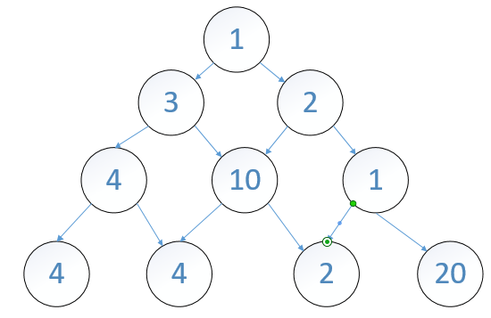
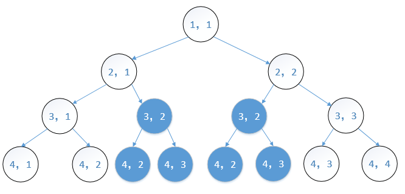

# 动态规划初步

## 数字三角形



求从上往下走最大数字和

数字三角形是动态规划中一个经典的入门例子，可以用，`d(i,j)`表示结点的数字，`maxsum(i,j)`最优解，则这个问题就是求`maxsum(1,1)`表示这个结点学过递归的人基本都可以得到一个状态转移方程：

`d(i,j)=a(i,j)+max{d(i+1,j),d(i+1,j+1)}`

简单地说就是从每个格子`(i,j)`出发有两种决策。如果往左走，则走到`(i+1,j)`，往右走，则走到`(i+1,j+1)`，先其中一个使和最大的值，即为上面的状态转移方程。看似这是一个局部最优解，实际从最后第二层看这个方式，则满足全局最优解。这个性质称为最优子结构，也可以描述成“全局最优解包含局部最优解”。

因此可以得到如下计算过程：

```c++
ind maxsum(i,j)
{
	if(i==N)		//边界
		return d[i][j];
	else
		return d[i][j]+max{d(i+1,j),d(i+1,j+1)}
}
```

**但是** ，如上有个问题就是会重复计算，如下图中`maxsum(3,2)`就初计算了两次，一次是`maxsum(2,1)`，一次是`maxsum(2,2)`，如果原来的三角形有`n`层，则调用关系树了也会有`n`层，一共有`2^(n)-1`结点，复杂度为`O(2^n)`。这就是一般的递归与动态规划一个区别点，动态规划的问题一般会有重叠的部分，所以要做一些额外的处理，如记忆存储，判断不重复等。



如下即为解决方案，把`maxsum(i,j)`都初始化为负值，每次递归时判断为负值即计算，不为负值则不用。

```c++
int slove(int i,int j)
{
	if(maxsum[i][j]>0) 
      	return max[i][j];
  	else 
      return maxsum[i][j] = d[i][j] + max{maxsum(slove(i+1,j),slove(i+1,j+1))}
}
```

**不过** ，这还不是最优解，因为递归会占用太多内存空间，我们可以用非递归的方法代替。方法就是自下而上的方法，从最后一层开始，一步步找问题的最优解。如下图过程。

第一步：

|      |      |      |      |
| :--: | :--: | :--: | :--: |
|      |      |      |      |
|  8   |  13  |  21  |      |
|  4   |  3   |  2   |  20  |

第二步：

|      |      |      |      |
| :--: | :--: | :--: | :--: |
|  11  |  23  |      |      |
|  8   |  13  |  21  |      |
|  4   |  3   |  2   |  20  |

第三步：

|  24  |      |      |      |
| :--: | :--: | :--: | :--: |
|  11  |  23  |      |      |
|  8   |  13  |  21  |      |
|  4   |  3   |  2   |  20  |

如果你知道一点维特比算法的话，这个就像是它的简单版，当然在优化代码时，可以用一个一维的数组来存储上面的数据，无需用一个矩阵表。

### 参考资料：

1.[教你彻底学会动态规划-入门篇](http://blog.csdn.net/baidu_28312631/article/details/47418773)

2.《算法竞赛入经典》

