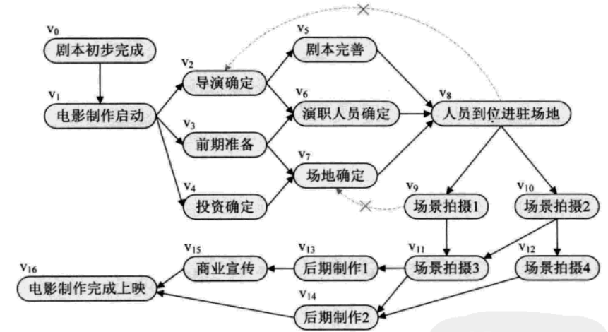
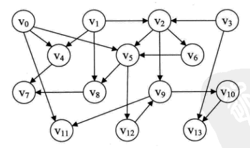
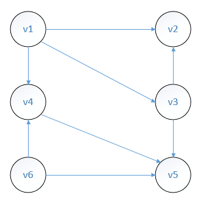
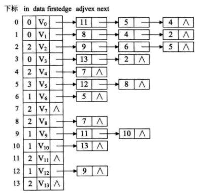
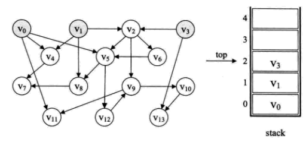
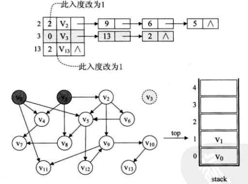

# 拓扑排序

在一个表示工程的有向图中，用顶点表示活动，用弧表示活动之间的网，我们称为AOV网`(Activity On Vertex Network)`。



设G=(V,E)是一个具有n个顶点的有向图，V中的顶点序列`v1,v2,......,vn`,满足若从顶点`vi`到`vj`有一条路径，则在顶点序列中顶点`vi`必在`vj`之前。则我们称这样的顶点序列为一个拓扑序列。上图的拓扑序列不止一条。

所谓拓扑排序，其实就是对一个有向图构造拓扑序列的过程。构造拓扑排序，其实就是对一个有向图构造拓扑序列的过程。

## 要达到的目的

在图论中，由一个有向无环图的顶点组成的序列，当且仅当满足下列条件时，称为该图的一个拓扑排序（英语：Topological sorting）。
- 1）每个顶点出现且只出现一次；

- 2）若A在序列中排在B的前面，则在图中不存在从B到A的路径。
  也可以定义为：拓扑排序是对有向无环图的顶点的一种排序，它使得如果存在一条从顶点A到顶点B的路径，那么在排序中B出现在A的后面。

  

  上图中，一种可能的拓扑排序为：`3->1->2->6->0->4->5->8->7->12->9->10-13-11`

  一个简单的例子：


一种可能的拓扑排序为：v6-v1-v4-v3-v2-v5，即先去掉v6，再去掉v1，再去掉v4...

## 算法步骤

- 1）从有向图中选取一个没有前驱(入度为零)的顶点，并输出之；
- 2）从有向图中删去此顶点以及所有以它为尾的弧；

重复上述两步，直至图空，或者图不空但找不到无前驱的顶点为止。没有前驱 -- 入度为零，删除顶点及以它为尾的弧-- 弧头顶点的入度减1。

结构：1、采用带有入度的邻接表表示图模型，如



2、栈

```
把入度为零的结点入栈
while(栈不为空)
{
  	出栈并打印栈顶元素；
  	出栈数加1；
  	for(遍历这个结点的子结点)
  	{
      	子结点的入度减1；
      	if(子结点入度为0)
      		子结点进栈；
  	}
  	if(总输出节点小于总结点数)
  		说明有回环，输出错误
}
```





## 复杂度分析：

分析整个算法，对一个具有n个顶点e条弧的AOV网来说，将入度为0的顶点入栈的时间复杂度为`O(n)`，而之后的while循环中，第个结点进一次栈，出一次栈，入度减1的操作共执行了e次，所以整个算法的复杂度为O(N+e)。

## 参考资料：

1、《大话数据结构》——第七章

2、[[拓扑排序的原理及实现](http://blog.csdn.net/jasmine_shine/article/details/43488895)](http://blog.csdn.net/jasmine_shine/article/details/43488895)

3、[拓扑排序](http://www.cnblogs.com/dolphin0520/archive/2011/04/16/2017737.html)

