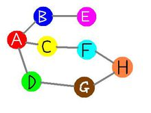

# 深度优先搜索与广度优先搜索

深度优先与广度优先搜索或遍历，都属于盲目搜寻法，可以用到许多问题上，如排列结合，二叉树的遍历，图的遍历等等，故理解它的思想更为重要。许多问题采用深度优先与广度优先都可以解决。

## 深度优先搜索`(DFS)`——不撞南墙不回头

###  1.思想：

“不撞南墙不回头”，直接表达了`DFS`的思想，即在访问一个新节点时，判断这个结点所有未访问的子结点，选择一个未访问的子结点，再执行上面的判断，如果这个结点已经没有可访问的子结点了，则回退到上一个结点，继续深入判断，直到回退到起点位置。简单的说，就是选择一条路走到底，走不通了，就返回走，回到上一个分岔口，选择另一条路，走到底，没有路了，再回到之前的分岔口，这个时候这个岔口已经没有未走过的路的话，就又回到上一个分岔口，重复以上过程。

本质上，这种思想是与**栈**很类似，为了实现深度优先搜索，首先选择一个起始顶点并需要遵守三个规则：

- (1)  如果可能，访问一个邻接的未访问顶点，标记它，并把它放入栈中。
- (2)  当不能执行规则1时，如果栈不空，就从栈中弹出一个顶点。
- (3)  如果不能执行规则1和规则2，就完成了整个搜索过程。

### 2.例子

1.全排列问题：如求`1,2,3,4`的全部排列结合。假想四个桶，先个桶放入不同的牌产生不同的结果

```
初始化手上没用到过的手牌book[] = 0;
第i步的深搜DFS(i)
{
	if(已经到达最后一个桶)
		返回并输出排列结果;
	for(所有可能的手牌)
		if(是否这张手牌还未使用book[i]==0)
		{
        	标记已使用book[i]=1;
        	调用下一步探搜DFS(i+1);
        	回收手牌book[k]=0;
		}
}
```

2.等式填数问题：`XXX+XXX=XXX`，在每个X中不重复的填入0到9之间的数字。

3.图的遍历：假设从A点出发，遍历所有的点的，顺序可能是：A->B->E->C->F-H-G-D或A->D-G-H-F-C-B-E等六种可能。图的遍历实际是可以引申出许多现实中的问题。




3.迷宫救人问题：

```
定义可以行走的四个方向：如next[4][2]={{0,1},{1,0},{0,-1},{-1,0}}
初始化未经过的点的book[]=0
每i步深搜DFS(x,y,i)
{
	判断是否救到人，是否为最短路径
	for(四个方向)
	{
 		计算下一步的坐标；
 		判断是否越界
 		if(是否有障碍与是否还未经过）
 		{
      		标注已走过book[x][y]=1;
      		调用下一步深搜DFS(i,j,i);
      		尝试结束book[x][y]=0;
 		}
 	}
}
```

4.炸弹人，其实是矩阵图的遍历

5.最短路径问题

6.二叉树的遍历，即对应前序遍历，中序遍历，与后序遍历

7.岛上冒险，遍历岛上所有的陆地，求面积。着色法，拓展问题如求图中一共有多少个岛，枚举所有大于零的点，访问过的岛标记为负号，多个岛即有多个负号，这就是漫水填充法。另一拓展问题如求最快到达岸边的路径

### 3.通用算法实现

```
void dfs(int step)
{
	if( 是否越过边界 )
	{
		...
		return ;
	}
	//尝试每一种可能，也可以调用多个dfs()
    for(i=1;i<=n;i++)
	{
		book[]=1;	//标记这个点用过
		//继续下一步 dfs(step+1);
		//book[] = 0;//取消这个点的标记，看情况而定，排列与最短路径要收回，图的遍历不用
	}
}
```

## 广度优先搜索——层层递进

 ### 1、思想

如果说深度优先搜索像栈结构，那么广度优先搜索利用的也是队列的思想。

实现广度优先搜索，也要遵守三个规则：

- (1) 访问下一个未来访问的邻接点，这个顶点必须是当前顶点的邻接点，标记它，并把它插入到队列中。
- (2) 如果因为已经没有未访问顶点而不能执行规则1时，那么从队列头取一个顶点，并使其成为当前顶点。
- (3) 如果因为队列为空而不能执行规则2，则搜索结束。

### 2、例子

1.图的遍历：还是之前的例子，一种可能的顺序为A->B-C->E->C->D-F-D-H-G


2.二叉树的遍历：对应的是层次遍历

3.最短路径，`BFS`相比`DFS`，对相同权值的问题更适合，比如最少转机问题，主要时间效率高，不用遍历所有的情况，只要遍历到最短的一条就结束，而`DFS`必需遍历所有的路线，再比较得到最小值。

### 通用算法实现：

```
BFS()
{
	初始化队列，第一个顶点入队
	while(队列不为空)
	{	
			for(尝试所有可能)
			{
				满足条件并没有访问过，入队
			}
			队列首结点出队
	}
}
```


### 参考资料：

1、《啊哈，算法》第四章：万能的搜索

2、[百度百科](http://baike.baidu.com/link?url=bB98AUAkF8WMc3OCt_tzqei-hiIN7AvOdDZZqORUEEOtBrekEtfBFKP8j1FGWIWQ3uqhZcr4DMYGh0qxssh5Xqx1AWNiVDPKos11ktkeOsd59LN7ZRhMN9Lr075eo6v9yJeXOTFlffQD5f5lAlCX7K)

3、[深度优先搜索与广度优先搜索](http://blog.csdn.net/andyelvis/article/details/1728378)


